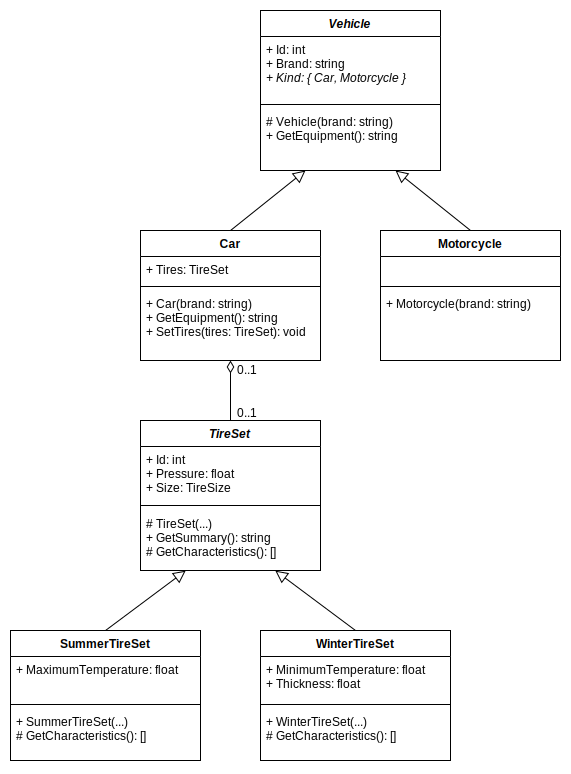

# MED-EL - OO Exercise

## Projects
- MedEl.API - a Web API project that exposes the service endpoints
- MedEl.Domain - contains the domain models
- MedEl.Infrastructure - describes persistance infrastructure and DI setup
- MedEl.UnitTests - contains the unit tests of the service
- docker compose - responsible for the instantiation of the required services

## How to run

1. navigate to the 'src' folder
1. open a console terminal
1. run the following command to spin up the required services
    ```
    docker compose up -d
    ```
1. run the following command to build and run the app (or use VSCode to open the 'src' folder and run from there)
    ```
    dotnet run --project .\MedEl.API\
    ```
1. if not opened automatically - you can open the [Swagger UI](http://localhost:5253/swagger) and start calling the API endpoints
1. Finally, you can check the logs at the [Seq UI](http://localhost:5341/#/events)

**_NOTE:_** Depending on the way you run the app - the protocol and port might differ.
    

## How to run the tests

1. navigate to the 'src' folder
1. open a console terminal
1. run the following command to build and run the unit tests
    ```
    dotnet test .\MedEl.UnitTests\
    ```

## Domain Model diagram:
